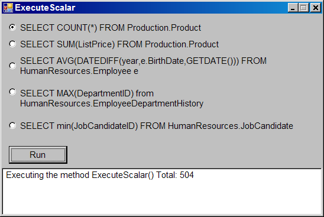

# How to execute simple Database Queries with VB .NET

The SqlCommand class in the .NET Framework Data Provider has four methods that you can use to execute SQL statements:

<ul>
<li><b>ExecuteScalar:</b> Executes a query that returns a single scalar value.</li>
<li><b>ExecuteReader:</b> Executes a query that returns a result set.</li>
<li><b>ExecuteNonQuery:</b> Executes a data update statements or a catalog update statement.</li>
<li><b>ExecuteXmlReader:</b> Executes a query that returns an Extensible Markup Language (XML) result set, this method is only avaliable in the SqlCommand class.</li>
</ul>

To execute a simple database query

<pre>
Import the System.Configuration namespace
</pre>

Use the ConfigurationManager.ConnectionStrings property to get a collection of connection strings from the application configuration file.
Index into the collection of connection strings by using the programmatic name of the connection string you want to access.

<ul>
<li>Use the ConnectionString property to get the connection string information.</li>
<li>Create a connection object.</li>
<li>Create a command object.</li>
</ul>

If you want to execute an SQL statement, set the CommandType property of the command object to the CommandType.Text enumeration value. If you want to call a stored procedure, set the CommandType property of the command object to the CommandType.StoredProcedure enumeration value.
<ol>
<li>Call the Open method on the connection object.</li>
<li>Call the ExecuteScalar method on the command object. Assign the result to a suitably typed variable.</li>
<li>Call the Close method on the connection object.</li>
</ol>
The following example shows how to execute a group of queries with aggregates functions to perform a calculation on a set of values from the <a href="https://learn.microsoft.com/en-us/sql/samples/adventureworks-install-configure?view=sql-server-ver16&tabs=ssms">AdventureWorks</a> database on the local SQL Server instance and return a single value.

Fig 1. Main program, running the first query

Fig 2. Running the second query

Fig 3. Running the third query

Fig 4. Running the fourth query

Fig 5. Running the last query

